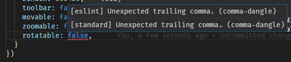

- [Introduction](#sec-1)
- [JavaScript](#sec-2)
  - [Equality](#sec-2-1)
    - [Problem](#sec-2-1-1)
    - [Solution](#sec-2-1-2)
  - [Arrow Functions](#sec-2-2)
  - ["Classes"](#sec-2-3)
  - [Promises](#sec-2-4)
  - [Generic tooling](#sec-2-5)
    - [ESLint](#sec-2-5-1)
    - [Webpack](#sec-2-5-2)
- [Web](#sec-3)
- [Git](#sec-4)


# Introduction<a id="sec-1"></a>

# JavaScript<a id="sec-2"></a>

## Equality<a id="sec-2-1"></a>

### Problem<a id="sec-2-1-1"></a>

What do you think is gonna happen below?

```js
return 1 == 1;
```

What about this?

```js
return 1 === 1;
```

😲 So what's the difference ??!?!?

Well, let's try this&#x2026;

```js
return 1 == '1';
```

**Huh?**

```js
return 1 == [1];
```

**!!!**

```js
return 1 == true; // wat
```

    true

Ok, ok, we get the point. Why does this happen?

In JavaScript, `==` is the *abstract equality operator*. When comparing values with `==`, it converts both values to a common type. As an example, with [5](#org793ab51), it converts the `true` to a number before comparing.

```js
return Number(true)
```

So since 1 is equal to 1, `1 == true` evaluates to true.

### Solution<a id="sec-2-1-2"></a>

`===` is the strict equality operator. If the values are of different types, they're unequal.

```js
console.log(1 === '1');
console.log(1 === [1]);
console.log(1 === true);
return (undefined === null);
```

Well, most of the time anyway. You still get magical edge cases like this.

```js
return NaN === NaN;
```

TLDR; with JavaScript, **ALWAYS** use the strict equality operator (`===`) for comparison unless you really know what you're doing with `==`.

## Arrow Functions<a id="sec-2-2"></a>

Consider the following function:

```js
function multiply (x, y) {
    return x * y;
}
```

-   [ ] Something about anonymous

Arrow functions were influenced by CoffeeScript, a functional programming language that transpiled into JavaScript.

They make simple functions a lot more concise.

```js
const multiply = (x, y) => x * y;
```

The difference is particularly apparent when they're passed as arguments e.g. in Promise chains.

```js
fetch('www.example.com/api/v3')
    .then(function (response) {
        return response.json();
    })
    .then(function (json) {
        console.log(json);
    })

/* Versus */
fetch('www.example.com/api/v3')
    .then(response => response.json())
    .then(json => console.log(json))
```

But surely they weren't added just for a little syntactic sugar?

## "Classes"<a id="sec-2-3"></a>

## Promises<a id="sec-2-4"></a>

## Generic tooling<a id="sec-2-5"></a>

### ESLint<a id="sec-2-5-1"></a>

Fundamentally, ESLint is a utility that enforces a collection of rules (a style guide) that your code needs to adhere to. By enforcing these set of rules, ESLint is able to catch errors that you might have failed to notice when writing JS (e.g. a dangling comma, syntax errors, accidental globals). 

ESLint further enforces the formatting conventions of your code, prompting you to write code in a uniform fashion that you and your teammates can easily understand and maintain.

Moreover, ESLint is plugin based and different kinds of style guides can be configured for your project to catch JS errors and enforce formatting conventions. 

Here's a quick look of ESLint in action in Visual Studio Code:



To sum up, ESLint is a utility implemeted in JS projects to ensure that the code you write meets the rules it enforces, so as to keep your code base consistent and as error free as possbile.

### Webpack<a id="sec-2-5-2"></a>

# Web<a id="sec-3"></a>

# Git<a id="sec-4"></a>
